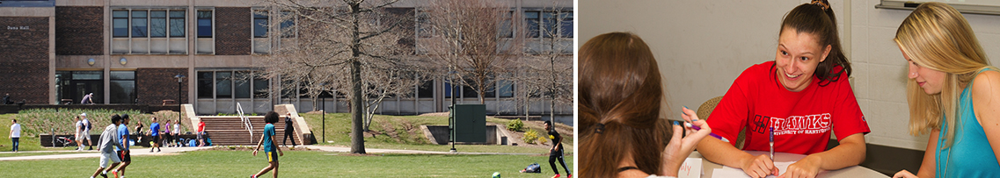

Want a banner image? Find the image you want and store it in the images directory with the name `banner.jpg`. (Or you can modify the file name in the next line, with any image URL you want.

{img:height="300px" width="100%"}

If you don't want a banner, delete this line and all above it.

## Change this to the title of your site.

**Menu**: [Schedule](schedule.md) : [Assignments](assignments.md) : [Data sets](datasets.md) 

This is a simple website where every document is a simple text file. 

* It consists of several documents (as many or few as you want), all of which can written with Markdown syntax. Thus, every document's names ends with the `.md` suffix.
* There's an optional horizontal menu just below the title. 
    - You can change the *names* of the menu items by editing the text in the *square brackets*. 
    - You can change the *target* file for the menu item by editing the name of the file in the *parentheses*.
    - You can add or delete items from the menu line just by adding or removing new elements with the link structure: `[Menu item name](menu_item_file.md)`.
* You can delete or modify any element, as you like, add new pages.
* If you become familiar with RStudio, and can edit Rmd files, there's another template available [here](github.com/StatPREP/Rmd-website-template) which will let you do 

